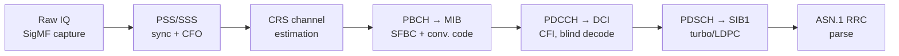

# Three-Layer SDR Receiver Framework

**A from-scratch LTE / 5G NR receiver in Python — every signal-processing block implemented directly from the 3GPP specifications — running inside a three-layer, actor-based framework that decodes real off-the-air signals faster than real time.**


The receive chain — PSS/SSS synchronization and CFO estimation, channel estimation, SFBC combining, convolutional/polar/LDPC decoding, and ASN.1 RRC parsing — is implemented from the 3GPP specifications, with the relevant clauses cited along the way. The walkthrough notebooks run it stage by stage on an off-the-air LTE downlink capture (806 MHz, 30.72 Msps, SigMF), from raw IQ samples to decoded MIB and SIB1 fields.

---

## Start here

| Notebook | What it shows |
|---|---|
| [`notebook/LTE_SIB1_10MHz.ipynb`](notebook/LTE_SIB1_10MHz.ipynb) | **Step-by-step LTE receive chain** on the off-the-air capture: spectrogram inspection → PSS (Zadoff–Chu) detection → CFO estimation → SSS → CRS channel estimation → PBCH/MIB decoding (Alamouti SFBC, TS 36.211 §6.3.3.3/§6.3.4.3) → SIB1 decoding, with intermediate plots (correlation peaks, channel estimates, constellations) saved at every stage. |
| [`notebook/NR_SIB1.ipynb`](notebook/NR_SIB1.ipynb) | **The 5G NR counterpart** on a recorded NR capture: SSB detection (PSS/SSS/DMRS) → PBCH polar decoding → MIB → Type0-PDCCH common search space (`searchSpaceZero`) → DCI 1_0 blind decoding (polar) → PDSCH LDPC decoding (lifting-set selection, TS 38.212 Table 5.3.2-3) → SIB1. |
| [`main.ipynb`](main.ipynb) | **The full system, running in parallel**: the three-layer actor framework executes cell search → MIB → SIB1 concurrently on the capture, with experiments sweeping buffer sizes, ingestion rates, and per-stage concurrency — sustaining faster-than-real-time throughput on a multi-core CPU. |
| [`notebook/pdcch.ipynb`](notebook/pdcch.ipynb) / [`notebook/pdsch.ipynb`](notebook/pdsch.ipynb) | Deep dives into LTE PDCCH (CFI 1/2, blind decoding) and PDSCH processing. |
| [`notebook/LTE_SIB1_DC.ipynb`](notebook/LTE_SIB1_DC.ipynb) / [`notebook/LTE_SIB1_n10MHz.ipynb`](notebook/LTE_SIB1_n10MHz.ipynb) | The same LTE chain applied to the other two carriers in the capture — the recording contains three adjacent LTE carriers, and all three are decoded. |

All notebooks ship with their outputs saved, so the figures and decoded results render directly on GitHub — no need to run anything to follow along.

## The receive chain



Every stage cites the clause it implements (TS 36.211–213/331 for LTE, TS 38.211–213 for NR), and SIB1 payloads are parsed against the actual RRC ASN.1 schema ([`src/lte-rrc-15.6.0.asn1`](src/lte-rrc-15.6.0.asn1)) rather than hand-decoded.

## The three-layer framework

The same chain that the walkthrough notebooks develop linearly is executed concurrently by a lightweight actor system ([`include/`](include/)):

1. **Data layer** — a buffer manager feeding a protected circular buffer, decoupling sample ingestion from processing ([`buffer_manager_actor.py`](include/buffer_manager_actor.py), [`protected_circular_buffer.py`](include/protected_circular_buffer.py)).
2. **Processing layer** — a flow graph of function nodes executed by a worker pool, with per-stage concurrency (cell search, MIB decode, SIB1 decode as independent actors) ([`flow_graph.py`](include/flow_graph.py), [`actor_system.py`](include/actor_system.py)).
3. **Control layer** — a controller actor that manages acquisition vs. tracking, dispatches work across stages, and bounds tracking depth ([`controller_actor.py`](include/controller_actor.py)).

[`main.ipynb`](main.ipynb) sweeps the operating points — infinite vs. finite buffers, ingestion rate, serial vs. parallel per-stage concurrency — and shows the system holding real-time throughput under realistic constraints. Each framework module has a paired notebook in [`include/`](include/) with its unit tests.

This repository is the Python reference implementation of the architecture; its real-time C++/TBB counterpart runs live LTE cell search on base-station signals.

## Repository layout

```
├── main.ipynb          # Full parallel system + performance experiments
├── notebook/           # Step-by-step PHY walkthroughs (LTE ×3 carriers, NR, PDCCH, PDSCH)
├── include/            # Framework + DSP modules (each with a paired test notebook)
├── data/               # Off-the-air LTE capture (SigMF, Git LFS) + preprocessing
└── src/                # 3GPP RRC ASN.1 schema for SIB1 parsing
```

## Running it

```bash
git lfs install                      # the capture in data/ is stored with Git LFS
git clone https://github.com/Haotian-RA/three_layer_framework.git
cd three_layer_framework
pip install numpy scipy matplotlib numba asn1tools jupyter
jupyter lab
```

Open any notebook above — the saved outputs let you read them top-to-bottom without executing, or re-run them end-to-end against the included capture.

## Dissertation

The framework in this repository — together with its real-time C++/TBB counterpart — is part of my Ph.D. dissertation at George Mason University (advised by Prof. Bernd-Peter Paris):

> H. Zhai, *A Multi-Level, High-Performance Architecture for Modern Software-Defined Radios*, Ph.D. dissertation, George Mason University, 2026.

Publications from this line of work:

- H. Zhai, B.-P. Paris, "Practical Methods for Joint Time and Carrier Synchronization in LPI/LPD Communications," *IEEE MILCOM*, 2022.
- H. Zhai, B.-P. Paris, "Accurate and Efficient Implementations of Recursive Filtering based on SIMD and Cascaded Form," *IEEE CCWC*, 2024.
- H. Zhai, B.-P. Paris, "Fast Cascaded Recursive Filtering via a Block-Matrix Reformulation," *IEEE Trans. Signal Processing*, under review, 2026 ([arXiv:2607.14054](https://arxiv.org/abs/2607.14054)).

## Author

**Haotian Zhai** — Ph.D. in Electrical and Computer Engineering, George Mason University
Software-defined radio architectures · LTE/5G NR physical layer · high-performance signal processing
📧 hzhai26@outlook.com
